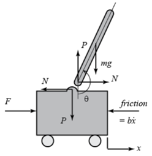

## Inverted Pendulum의 동역학 해석

어떤 시스템에 대한 제어기를 설계할때 가장 먼저 해야하는 것이 시스템에 대한 동역학 해석이라고 생각한다.
 

</img> 
위의 사진과 같이 추는 달려있지 않는 하나의 pole과 cart가 있는 시스템이다.
 
|기호|뜻|값|
|-|-|-|
|M|카트의 질량|1kg|
|m|진자의 질량|0.3kg|
|l|진자의 질량 중심까지의 길이|30cm|
|b|카트의 마찰계수|0.5Kg/s|
|r|볼스크류 1회전당 이동거리|1.27cm|
|Km|모터 토크 상수|4.9 Ncm/A|
|Kb|모터 역기전력 상수|0.0507V/rad/s|
|R|모터 전기자 저항|$0.3 \Omega$ |
 
 

카트의 운동에 대한 방정식을 구하면 다음과 같다.

</img> 
 
이때 $N$은 다음과 같다
</img> 
(1)식과 (2-3) 식을 연립
</img> 
진자에 수직인 힘을 구하면 다음과 같다
</img> 
진자의 회전운동에 관한 식은 다음과 같다
</img> 
(5) 식을 (4) 식에 대입
</img> 

비선형 시스템을 진자가 수식이 되는 즉 $ \theta = \pi + \phi$ 구간에서 선형화 시킵니다.
</img> 

